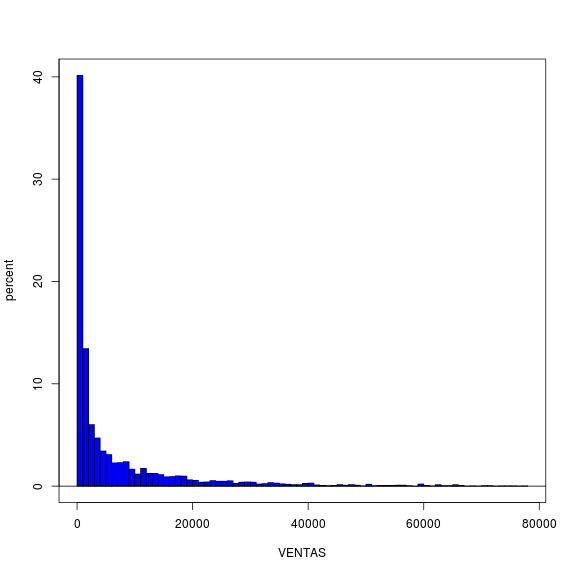
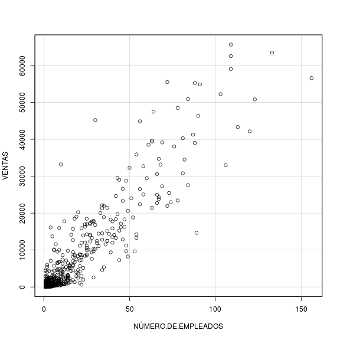

<!-- R Commander Markdown Template -->
+
Se pretende realizar un análisis descriptivo de la actividad que siguen las ventas de
dispositivos móviles y electrónicos de una franquicia en España (toda la información
está desglosada por provincias en el archivo Excel correspondiente).


La práctica va a desarrollarse en R y en Excel. En el Excel adjunto muestro el valor de los estadísticos y correlaciones al ser mas amigable su formato que el que arroja R.


### 1   Descripcion de los datos
### 1.1 Descripción de los datos en España

Los resultados de los estadistios y las correlaciones están en la pestaña "Analisis España" del Excel "Practica_Estadisticos.xls". Los de Madrid y Barcelona se encuantran en sus respectivas pestañas. En el mencionado Excel obtenemos una interesante correlacion entre las variables VENTAS y NUMERO DE EMPLEADOS que tambien se observa en Madrid y Barcelona
En R, nos vamos a focalizar en las varaibles VENTAS y EMPLEADOS. Cargamos el Excel:


```r
> file <-"/home/bellinsky/Documents/datahack/estadistica/practica.xlsx"
> datahackStat <- readXL(file, rownames=FALSE, header=TRUE, 
+   na="", sheet="Datos", stringsAsFactors=TRUE)
```


investigamos los estadísticos de las variables VENTAS y NUMERO DE EMPLEADOS 
empezamos por la media, la desviacion tipica y el coeficiente de Pearson


```r
> numSummary(datahackStat[,c("NÚMERO.DE.EMPLEADOS", "VENTAS")], statistics=c("mean", "sd","IQR", "cv"))
```

```
                          mean          sd     IQR       cv    n
NÚMERO.DE.EMPLEADOS   16.33591    22.53541   18.00 1.379502 4403
VENTAS              6648.15591 11177.25221 7325.02 1.681256 4403
```
el Coeficiente de Pearson (cv) observado en las dos variables estudias es mayor que 1. Por lo tanto en ambas variables, la media no es un estadístico descriptivo de la muestra

ahora, los percentiles


```r
> numSummary(datahackStat[,c("NÚMERO.DE.EMPLEADOS", "VENTAS")], statistics=c( "quantiles", quantiles=c(0,.25,.5,.75,1)), type="1")
```

```
                       0%     25%      50%      75%     100%    n
NÚMERO.DE.EMPLEADOS 1.000   3.000    7.000   21.000   169.00 4403
VENTAS              4.924 494.886 1592.143 7819.906 77055.79 4403
```
la mediana (percentil 50%) se encuentra muy por debajo de la media en ambas variables. En otras palabras, mas de la mitad de las tiendas representan poco volumen de ventas y tiene pocos empleados

por ultimo, la asimetria y la curtosis:


```r
> numSummary(datahackStat[,c("NÚMERO.DE.EMPLEADOS", "VENTAS")], statistics=c(  "skewness", "kurtosis", type="1"),type="1")
```

```
                    skewness kurtosis    n
NÚMERO.DE.EMPLEADOS 2.603358 8.532849 4403
VENTAS              2.815738 9.110339 4403
```

Al ser ambos coeficientes de asimetria (skewness) positivos, la distribucion de las variables se va a concentrar en la parte izquierda del histograma. En otras palabras, tenemos muchas tiendas con pocas ventas y pocos empleados
Por ultimo, para la Kurtosis, podemos decir que el dato no es relevante ya que la media no es representativa de la distribucion. 

Dibujemos a continuación el gráfico de cajas de las VENTAS:


```r
> ggplot(data=datahackStat, aes(Franquicias,VENTAS)) +scale_y_continuous(limits=c(0,2000))+ geom_boxplot(outlier.shape = NA) + stat_summary(fun.y=mean, colour="darkred", geom="point", 
+                            shape=18, size=3,show_guide = FALSE)
```

```
Warning: `show_guide` has been deprecated. Please use `show.legend`
instead.
```

```
Warning: Removed 2044 rows containing non-finite values (stat_boxplot).
```

```
Warning: Removed 2044 rows containing non-finite values (stat_summary).
```


La media queda por encima de la mediana, esto significa que el histograma va a ser asimétrico hacia la izquierda, tal como nos indica el coeficiente de asimetría anteriormente calculado.

Representemos a continuacion el diagrama de caja de la variable NUMERO DE EMPLEADOS


```r
> ggplot(data=datahackStat, aes(Franquicias,NÚMERO.DE.EMPLEADOS)) + scale_y_continuous(limits=c(0,50)) + geom_boxplot(outlier.shape = NA) +
+      stat_summary(fun.y=mean, colour="darkred", geom="point", 
+                            shape=18, size=3,show_guide = FALSE)
```

```
Warning: `show_guide` has been deprecated. Please use `show.legend`
instead.
```

```
Warning: Removed 330 rows containing non-finite values (stat_boxplot).
```

```
Warning: Removed 330 rows containing non-finite values (stat_summary).
```


La media queda por encima de la mediana, esto significa que el histograma va a ser asimétrico hacia la izquierda, tal como nos indica el coeficiente de asimetría anteriormente calculado.


Representamos a contincuacion el grafico de puntos entre VENTAS y NUMERO.DE.EMPLEADOS y calculamos la recta de regresión lineal:

```r
> scatterplot(VENTAS ~ NÚMERO.DE.EMPLEADOS , reg.line=FALSE, smooth=FALSE, spread=FALSE, boxplots=TRUE, span=0.5, ellipse=FALSE, levels=c(.5, .9), by.groups=TRUE, 
+   data=datahackStat)
> 
> 
> x<-datahackStat$NÚMERO.DE.EMPLEADOS
> y<-datahackStat$VENTAS
> 
> slope<-cov(x,y)/var(x)
> intercept<-mean(y)-slope*mean(x)
> 
> slope
```

```
[1] 441.0807
```

```r
> intercept
```

```
[1] -557.2968
```

```r
> abline(intercept,slope)
```


Vamos a calcular en R el intervalo de confianza para una eventual predicción de la variable VENTAS según este modelo lineal de regresión:

```r
> LinearModel_Empleados_Ventas <- lm(NÚMERO.DE.EMPLEADOS ~ VENTAS, data=datahackStat)
> summary(LinearModel_Empleados_Ventas)
```

```

Call:
lm(formula = NÚMERO.DE.EMPLEADOS ~ VENTAS, data = datahackStat)

Residuals:
    Min      1Q  Median      3Q     Max 
-94.905  -3.949  -1.818   2.758 119.269 

Coefficients:
             Estimate Std. Error t value Pr(>|t|)    
(Intercept) 4.4158048  0.1807387   24.43   <2e-16 ***
VENTAS      0.0017930  0.0000139  129.00   <2e-16 ***
---
Signif. codes:  0 '***' 0.001 '**' 0.01 '*' 0.05 '.' 0.1 ' ' 1

Residual standard error: 10.31 on 4401 degrees of freedom
Multiple R-squared:  0.7909,	Adjusted R-squared:  0.7908 
F-statistic: 1.664e+04 on 1 and 4401 DF,  p-value: < 2.2e-16
```

R nos da un pvalue menor que el nivel de significancia (0,05) por lo tanto las predicciones que haríamos según esta regresión lineal no nos dan evidencia estadística con una confianza del 95%


A continuación, dibujamos los histogramas de las variables VENTAS e HISTOGRAMA y constatamos la asimetría hacia la parte izquierda de los gráficos así como la alta concentración de tiendas con pocas ventas y pocos empleados


```r
> with(datahackStat, Hist(VENTAS, scale="percent", breaks=70, col="blue"))
```




```r
> with(datahackStat, Hist(NÚMERO.DE.EMPLEADOS, scale="percent", breaks=70, col="blue"))
```


## 1.2 Descripcion Datos de Madrid

los estadísticos y las correlaciones se encuentran en la hoja excel adjunta "practica_estadistica.xls". Observamos un comportamiento general muy parecido al de los datos de España, eso, sí, con correlaciones lineales entre VENTAS y NUMERO de Empleados para Madrid y Barcelona mayor que el de España
Vamos con el analisis de Madrid:

```r
> #Obtenemos los datos de ventas de Madrid
> madrid	  <- subset(datahackStat, PROVINCIA=="Madrid")
> madrid_ventas <-madrid[,c("VENTAS")] 
> #y los de los empleados
> madrid_empleados <-madrid[,c("NÚMERO.DE.EMPLEADOS")]
> 
> scatterplot(VENTAS ~ NÚMERO.DE.EMPLEADOS , reg.line=TRUE, smooth=FALSE, spread=FALSE, boxplots=TRUE, span=0.5, ellipse=FALSE, levels=c(.5, .9), by.groups=TRUE, 
+   data=madrid)
```


```r
> LinearModel_Empleados_Ventas <- lm(NÚMERO.DE.EMPLEADOS ~ VENTAS, data=madrid)
> summary(LinearModel_Empleados_Ventas)
```

```

Call:
lm(formula = NÚMERO.DE.EMPLEADOS ~ VENTAS, data = madrid)

Residuals:
    Min      1Q  Median      3Q     Max 
-45.285  -4.063  -2.660   1.917  70.633 

Coefficients:
             Estimate Std. Error t value Pr(>|t|)    
(Intercept) 3.765e+00  6.131e-01   6.141 1.74e-09 ***
VENTAS      1.804e-03  3.823e-05  47.184  < 2e-16 ***
---
Signif. codes:  0 '***' 0.001 '**' 0.01 '*' 0.05 '.' 0.1 ' ' 1

Residual standard error: 11.52 on 471 degrees of freedom
Multiple R-squared:  0.8254,	Adjusted R-squared:  0.825 
F-statistic:  2226 on 1 and 471 DF,  p-value: < 2.2e-16
```

```r
> with(datahackStat, Hist(madrid_empleados, scale="percent", breaks=70, col="blue"))
```


```r
> with(datahackStat, Hist(madrid_ventas, scale="percent", breaks=70, col="blue"))
```


## 1.3 Descripcion Datos de Barcelona

```r
> #Obtenemos los datos de ventas de Barcelona
> barcelona	  <- subset(datahackStat, PROVINCIA=="Barcelona")
> barcelona_ventas <-barcelona[,c("VENTAS")]
> barcelona_empleados <-barcelona[,c("NÚMERO.DE.EMPLEADOS")]
> scatterplot(VENTAS ~ NÚMERO.DE.EMPLEADOS , reg.line=TRUE, smooth=FALSE, spread=FALSE, boxplots=TRUE, span=0.5, ellipse=FALSE, levels=c(.5, .9), by.groups=TRUE, 
+   data=barcelona)
```



```r
> LinearModel_Empleados_Ventas <- lm(NÚMERO.DE.EMPLEADOS ~ VENTAS, data=barcelona)
> summary(LinearModel_Empleados_Ventas)
```

```

Call:
lm(formula = NÚMERO.DE.EMPLEADOS ~ VENTAS, data = barcelona)

Residuals:
    Min      1Q  Median      3Q     Max 
-56.782  -3.621  -1.677   3.254  58.428 

Coefficients:
             Estimate Std. Error t value Pr(>|t|)    
(Intercept) 3.611e+00  5.043e-01   7.161 2.61e-12 ***
VENTAS      1.839e-03  3.544e-05  51.893  < 2e-16 ***
---
Signif. codes:  0 '***' 0.001 '**' 0.01 '*' 0.05 '.' 0.1 ' ' 1

Residual standard error: 9.963 on 544 degrees of freedom
Multiple R-squared:  0.8319,	Adjusted R-squared:  0.8316 
F-statistic:  2693 on 1 and 544 DF,  p-value: < 2.2e-16
```

```r
> with(datahackStat, Hist(barcelona_ventas, scale="percent", breaks=70, col="blue"))
```


```r
> with(datahackStat, Hist(barcelona_empleados, scale="percent", breaks=70, col="blue"))
```


### 2 Analizar comparativamente Madrid y Barcelona, y también cada una de ellas respecto al total.
En ambas ciudades observamos una correlacion entre las VENTAS y NUMERO DE EMPLEADOS, siendo esta, mayor en Barcelona que en Madrid, y Madrid mayor que en España.
Vamos a dibujar los Diagramas de Caja de las variables VENTAS y NUMERO DE EMPLEADOS en España, Madrid y Barcelona:

```r
> esp_ventas<-datahackStat[,c("VENTAS")]
> boxplot(esp_ventas,madrid_ventas,barcelona_ventas,names=c("España Ventas","madrid Ventas","barcelona Ventas"))
> media_madrid<-mean(madrid_ventas)
> media_barcelona<-mean(barcelona_ventas)
> media_esp<-mean(esp_ventas)
> means<-c(media_esp,media_madrid,media_barcelona)
> points(means,col="red",pch=18)
```


Los diagramas de Caja de las Ventas muestran un comportamiento similiar en Madrid, Barcelona y España. En barcelona el intervalo intercuartilico es mayor que en Madrid y Barcelona, por lo tanto hay mas tiendas entre los percentiles 25% y 75% con mayor impacto sobre las ventas de la ciudad.


```r
> esp_empleados<-datahackStat[,c("NÚMERO.DE.EMPLEADOS")]
> boxplot(esp_empleados,madrid_empleados,barcelona_empleados,names=c("España Empleados","madrid Empleados","barcelona Empleados"))
> media_madrid<-mean(madrid_empleados)
> media_barcelona<-mean(barcelona_empleados)
> media_esp<-mean(esp_empleados)
> means<-c(media_esp,media_madrid,media_barcelona)
> points(means,col="red",pch=18)
```


En el caso del NUMERO DE EMPLEADOS, Madrid tiene un intervalo intercuartilico superior al de Barcelona, por lo tanto cualquier decision relativa a los empleados de las tiendas de Madrid tendrán un impacto mayor que en Barcelona

### 3 Decidir si existe alguna evidencia para poder afirmar que las ventas se comportan de forma diferente entre las dos provincias.
Vamos a contrastar el enunciado contrario, esto es, la hipótesis nula seria "Las ventas se comportan *igual* entre las dos provincias". Es decir vamos a contrastar si las dos variables de VENTAS presentan medias iguales (con varianzas distintas).

Vamos a calcular el estadístico para estimar la diferencia de dos muestras considerando que sus varianzas son distintas. La teoria estadistica nos indica que la diferencia de estas medias se comporta segun la distribucion T de Student con N grados de libertad.


Calumemos primero las cuasivarianzas de las ventas de ambas ciudades asi como el numero de observaciones:

```r
> var_ventas_madrid <-var(madrid_ventas)
> var_ventas_barcelona <-var(barcelona_ventas)
> n_ventas_madrid <- length(madrid_ventas)
> n_ventas_barcelona <- length(barcelona_ventas)
```
Calculemos a continuaciñon, el valor de la F:

```r
> f<-(var_ventas_madrid/n_ventas_madrid+var_ventas_barcelona/n_ventas_barcelona)^2/((var_ventas_madrid/n_ventas_madrid)^2/(n_ventas_madrid-1)+(var_ventas_barcelona/n_ventas_barcelona)^2/(n_ventas_barcelona-1))
> f
```

```
[1] 941.8342
```

Con la F y el nivel de signifacion (0,05) podemos calcular acudir a la tabla de la T de student para obtener en que punto se da la probabilidad 0,975 (1 - alpha/2)

```r
> t_Student_f_alpha_medios = qt(0.975,941)
> t_Student_f_alpha_medios
```

```
[1] 1.962488
```
Ahora podemos pasar a calcular el valor critico:

```r
> valor_critico=t_Student_f_alpha_medios*sqrt(var_ventas_madrid/n_ventas_madrid+var_ventas_barcelona/n_ventas_barcelona)
> valor_critico
```

```
[1] 1609.268
```
Y contrastarlo con la diferencia de medias:
abs(mean(x)-mean(y))


```r
> diferencia_medias=abs(mean(madrid_ventas)-mean(barcelona_ventas))
> 
> diferencia_medias
```

```
[1] 472.2004
```

```r
> valor_critico
```

```
[1] 1609.268
```
Pasamos ahora a calcular la Region de Rechazo:

```r
> Region_de_Rechazo=diferencia_medias>valor_critico
> Region_de_Rechazo
```

```
[1] FALSE
```
Y por último, podemos calcular el intervalo de confianza:

```r
> extremo_inferior_intervalo = diferencia_medias-valor_critico
> extremo_inferior_intervalo
```

```
[1] -1137.068
```

```r
> extremo_superior_intervalo = diferencia_medias+valor_critico
> extremo_superior_intervalo
```

```
[1] 2081.469
```
## Conclusiones

La diferencia de las medias (0) ha caido en el intervalo de confianza, por lo tanto la hipotesis Nula "__las medias de las dos distribuciones son iguales__" se acepta. Hay evidencia estadistica para decir que las distribuciones de ventas tanto de Madrid como de Barcelona __se comportan igual__


Vamos a hacerlo con R, para confirmar estos cálculos manuales, llamando a la funcion t.test indicando que ambas medias de las dos variables son iguales (Hipotesis NULA) y considerando que las varianas son distintas.
Pero antes, verifiquemos que efectivamente, las varianzas son distintas

```r
> #llamamos a la funcion var.test
> var.test(madrid_ventas,barcelona_ventas)
```

```

	F test to compare two variances

data:  madrid_ventas and barcelona_ventas
F = 1.3268, num df = 472, denom df = 545, p-value = 0.00144
alternative hypothesis: true ratio of variances is not equal to 1
95 percent confidence interval:
 1.115030 1.580658
sample estimates:
ratio of variances 
           1.32685 
```
Obtenemos un intervalo de confianza que **no contiene** al 1, por lo tanto la hipotesis nula se rechaza.
Efectivamente, la hipotesis de que las varianzas son distintas se cumple, vamos ahora a calcular el contraste mediante la llamada a la funcion t.Test de R:

```r
> #llamamos a la funcion t.test indicando que las muestras son independientes (paired=FALSE) y las varianzas distintas:
> t.test(madrid_ventas,barcelona_ventas, var.equal=FALSE, paired=FALSE)
```

```

	Welch Two Sample t-test

data:  madrid_ventas and barcelona_ventas
t = 0.57584, df = 941.83, p-value = 0.5649
alternative hypothesis: true difference in means is not equal to 0
95 percent confidence interval:
 -1137.066  2081.467
sample estimates:
mean of x mean of y 
 8072.073  7599.873 
```
Obtenemos un pValor (pvalue=0,5649) mayor que el nivel de signifiacion (0,005) por lo tanto, la hipotesis Nula es cierta. En otras palabras, podemos afimar al 95% de fiablidad que las medias de las VENTAS en Madrid y Barcelona se comportan igual. Llegamos a la misma conclusion que haciendo el cálculo manualmente.
### 4 Considerando las variables “Ventas” y “Productividad”, plantear una regresión lineal y describirla adecuadame

Vamos a calcular el coeficiente de correlacion lineal entre las variables VENTAS y PRODUCTIVIDAD


```r
> x<-datahackStat$PRODUCTIVIDAD
> y<-datahackStat$VENTAS
> 
> rxy2<-cov(x,y)/sd(x)*sd(y)
> 
> rxy2<-rxy2^2
> 
> rxy2
```

```
[1] 9.789095e+13
```

Obtenemos un coeficiente de correlación lineal próximo a cero, por lo tanto, las variables ventas y productividad no estan correlacionadas


